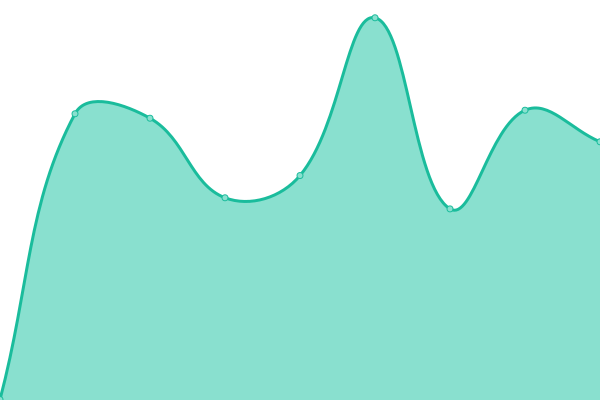
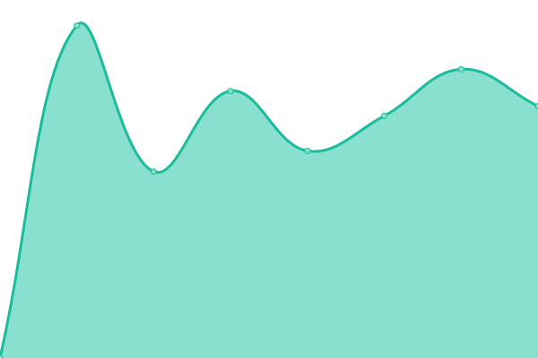
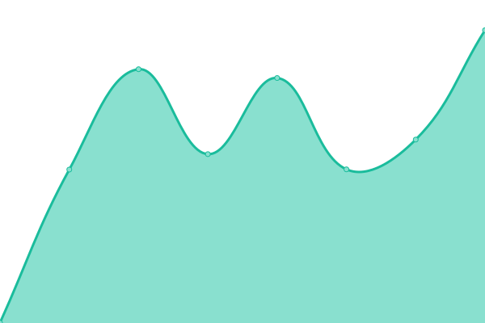
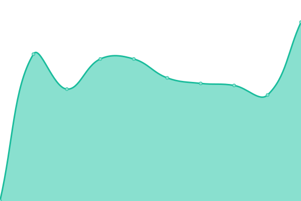

# [📈 Live Status](https://happecharger.github.io/upptime): <!--live status--> **🟧 Partial outage**

This repository contains the open-source uptime monitor and status page for [한국전기차충전서비스(주)](https://www.happecharger.com), powered by [Upptime](https://github.com/upptime/upptime).

With [Upptime](https://upptime.js.org), you can get your own unlimited and free uptime monitor and status page, powered entirely by a GitHub repository. We use [Issues](https://github.com/happecharger/upptime/issues) as incident reports, [Actions](https://github.com/happecharger/upptime/actions) as uptime monitors, and [Pages](https://happecharger.github.io/upptime) for the status page.

<!--start: status pages-->
<!-- This summary is generated by Upptime (https://github.com/upptime/upptime) -->
<!-- Do not edit this manually, your changes will be overwritten -->
<!-- prettier-ignore -->
| URL | Status | History | Response Time | Uptime |
| --- | ------ | ------- | ------------- | ------ |
|  [WEB](https://www.happecharger.com) | 🟩 정상 | [web.yml](https://github.com/happecharger/kevcs-upptime/commits/HEAD/history/web.yml) | 

 1461ms
     
 | 

<a href="https://happecharger.github.io/kevcs-upptime/history/web">99.21%</a>
    

|  [APP](https://app2.happecharger.com) | 🟩 정상 | [app.yml](https://github.com/happecharger/kevcs-upptime/commits/HEAD/history/app.yml) | 

 1083ms
     
 | 

<a href="https://happecharger.github.io/kevcs-upptime/history/app">99.21%</a>
    

|  [CMS](https://cms.happecharger.com) | 🟩 정상 | [cms.yml](https://github.com/happecharger/kevcs-upptime/commits/HEAD/history/cms.yml) | 

 1335ms
     
 | 

<a href="https://happecharger.github.io/kevcs-upptime/history/cms">100.00%</a>
    

|  [EVC](http://adm.kevcs.com:28088/) | 🟩 정상 | [evc.yml](https://github.com/happecharger/kevcs-upptime/commits/HEAD/history/evc.yml) | 

 602ms
     
 | 

<a href="https://happecharger.github.io/kevcs-upptime/history/evc">100.00%</a>
    

|  [ACC](https://acc.happecharger.com/) | 🟩 정상 | [acc.yml](https://github.com/happecharger/kevcs-upptime/commits/HEAD/history/acc.yml) | 

 1729ms
     
 | 

<a href="https://happecharger.github.io/kevcs-upptime/history/acc">100.00%</a>
    

|  [ADM](http://adm.happecharger.com/) | 🟩 정상 | [adm.yml](https://github.com/happecharger/kevcs-upptime/commits/HEAD/history/adm.yml) | 

 1124ms
     
 | 

<a href="https://happecharger.github.io/kevcs-upptime/history/adm">100.00%</a>
    

|  [XFR](https://api.happecharger.com/) | 🟩 정상 | [xfr.yml](https://github.com/happecharger/kevcs-upptime/commits/HEAD/history/xfr.yml) | 

 828ms
     
 | 

<a href="https://happecharger.github.io/kevcs-upptime/history/xfr">100.00%</a>
    

|  [EMSP](211.253.17.41) | 🟩 정상 | [emsp.yml](https://github.com/happecharger/kevcs-upptime/commits/HEAD/history/emsp.yml) | 

 151ms
     
 | 

<a href="https://happecharger.github.io/kevcs-upptime/history/emsp">100.00%</a>
    

|  [ASSEMBLE](http://noti.kevcs.co.kr:7200/) | 🟩 정상 | [assemble.yml](https://github.com/happecharger/kevcs-upptime/commits/HEAD/history/assemble.yml) | 

 819ms
     
 | 

<a href="https://happecharger.github.io/kevcs-upptime/history/assemble">100.00%</a>
    

|  [ESOL](https://api2.happecharger.com/appMain.do) | 🟩 정상 | [esol.yml](https://github.com/happecharger/kevcs-upptime/commits/HEAD/history/esol.yml) | 

 700ms
     
 | 

<a href="https://happecharger.github.io/kevcs-upptime/history/esol">99.22%</a>
    

|  [ESOL-DEV](https://tapi.happecharger.com/appMain.do) | 🟥 다운 | [esol-dev.yml](https://github.com/happecharger/kevcs-upptime/commits/HEAD/history/esol-dev.yml) | 

 621ms
     
 | 

<a href="https://happecharger.github.io/kevcs-upptime/history/esol-dev">60.35%</a>
    

|  [QR-PAY](211.253.17.41) | 🟩 정상 | [qr-pay.yml](https://github.com/happecharger/kevcs-upptime/commits/HEAD/history/qr-pay.yml) | 

 151ms
     
 | 

<a href="https://happecharger.github.io/kevcs-upptime/history/qr-pay">100.00%</a>
    

|  [CSWEB](https://cs.happecharger.com) | 🟩 정상 | [csweb.yml](https://github.com/happecharger/kevcs-upptime/commits/HEAD/history/csweb.yml) | 

 2039ms
     
 | 

<a href="https://happecharger.github.io/kevcs-upptime/history/csweb">100.00%</a>
    

<!--end: status pages-->

[**Visit our status website →**](https://happecharger.github.io/upptime)

## 📄 License

- Powered by: [Upptime](https://github.com/upptime/upptime)
- Code: [MIT](./LICENSE) © [Anand Chowdhary](https://anandchowdhary.com), supported by [Pabio](https://pabio.com)
- Data in the `./history` directory: [Open Database License](https://opendatacommons.org/licenses/odbl/1-0/)
